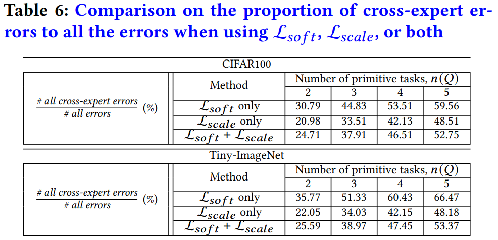
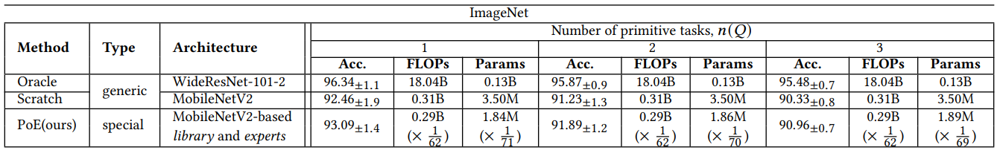

# Pool-of-Experts-code

This is the authors' implementation of the following paper:

"Pool of Experts: Realtime Querying Specialized Knowledge in Massive Neural Networks", SIGMOD, 2021

Hakbin Kim, Dong-Wan Choi

# Additional experimental results

### Experiments on the Effectiveness of Lsoft vs. Lscale

<table>
<td> Comparison between Lsoft and Lscale </td>
<tr>
<td></td>
</tr>
</table>

We conduct an experiment to examine whether our Lscale can help to address the logit scale problem, as described in Section 4.2. To this end, we focus on a specific type of errors caused by wrong experts that take a highest probability away from the correct expert, which we call cross-expert errors. This type of errors are distinguished from those locally made within the classes of an expert, and cross-expert errors are more likely to happen when logit scales of experts being merged are quite different.

In order to see the effectiveness of Lscale, we build a different group of experts intentionally trained by only Lsoft, and build task-specific models upon them by the same knowledge consolidation method. We then look into how the proportion of cross-expert errors to all the errors has been changed after we add Lscale when extracting experts. In Table 6, we can observe that the rates of cross-expert errors are reduced when we use Lscale along with Lsoft. Thus, the experts trained by both Lsoft and Lscale turn out to be more robust to cross-expert errors than those trained by only Lsoft. As the problem of overconfident experts has already been resolved by Lsoft, we can surely claim that minimizing the Lscale is effective to mitigate the logit scale problem.

We compared the merge results using PoE for Ei trained using only Lsoft and Lscale added LCKD, respectively, to see the effect of Lscale in Section 4.1. The results are shown in Table 6. The results showed the average of the results for each combination. In Table Table 6 out mis/all mis means the rate at which the misclassification occurred due to having the largest logit value in the wrong M(Hj) other than the model M(Hi) of the Hi to which each image belongs. Lsoft can confirm that the out mis/all mis are higher than the LCKD in both CIFAR-100 and Tiny-ImageNet, even though the high confidence issue has been resolved.

# Quick Start: CIFAR-100, TinyImageNet
We provide CIFAR-100 and TinyImageNet examples for Pool of Experts

### Preprocessing phase
    python Run_preprocessing.py

We provide Oracle in DB_pretrained, library and some experts in DB_PoE

You can check the accuracy of Oracle and each model for primitive tasks by executing the above command

### Service phase
    python Run_Service.py --queriedTask <primitive tasks>
*Example for CIFAR100*: `python Run_Service.py --queriedTask people vehicles_1 vehicles_2`

*Example for TinyImageNet*: `python Run_Service.py --queriedTask arachnid canine feline`

*CIFAR100 Available primitive tasks*: 

    'large_omnivores_and_herbivores', 'medium-sized_mammals', 'people', 'small_mammals', 'vehicles_1', 'vehicles_2'
    
*TinyImageNet Available primitive tasks*: 

    'arachnid', 'canine', 'feline', 'bird', 'ungulate', 'vertebrate_etc'

You can check the accuracy of model for queried composite task by executing the above command

### Implementation and training details for CIFAR100 and TinyImageNet
All algorithms were implemented using PyTorch and evaluated on a machine with an NVIDIA Quadro RTX 6000 and Intel Core Xeon Gold 5122.

When training all the models, we use a stochastic gradient descent (SGD) with 0.9 momentum and the weight decay of L-2 regularization was fixed to 5e-4. 

The batch size of all networks was set to 512.

In all networks, we set the temperature T for distillation to 4 and the weight parameter alpha for scale loss to 0.3.

In order to extract each expert by training primitive models, we train only the expert part (i.e., conv 4) for 100 epochs, where the initial learning rate is set to 0.1 and reduced by 0.1 times at 40 and 80 epochs. In our experiments, we randomly choose six of all the primitive tasks for both CIFAR-100 and Tiny-ImageNet. The setting of transfer learning is the same.

When training a target architecture without using the library part, the learning process was continued for 200 epochs, where the initial learning rate was 0.1 and reduced by 0.1 times at 80 and 160 epochs. 

In the WRN architecture for Tiny-ImageNet experiments, the stride of the first convolutional layer is set to 2 because the input size of Tiny-ImageNet is (64, 64, 3).

# Experimental results on ImageNet

<table>
<td> Model Specialization and Consolidation </td>
<tr>
<td></td>
</tr>
</table>

### Training details for ImageNet

We used the front part of MobilenetV2 as library and the number of channels in the back part of MobilenetV2 was significantly reduced and used as experts. (The detailed structure is expressed in ImageNet/PoE/network/pytorch_mobilenetV2.py.)

When training the experts, we use a stochastic gradient descent (SGD) with 0.9 momentum and the weight decay of L-2 regularization was fixed to 5e-4. 

We set the temperature T for distillation to 4 and the weight parameter alpha for scale loss to 0.3.

In order to extract each expert by training primitive models, we train only the expert part for 20 epochs, where the initial learning rate is set to 0.01 and reduced by 0.1 times at 10 and 15 epochs. In our experiments, we randomly choose four of all the primitive tasks for ImageNet.
